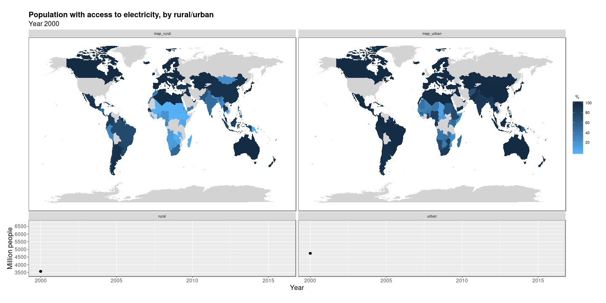

# UN SDG data analysis

Capstone project for the [HarvardX Data Science program](https://www.edx.org/professional-certificate/harvardx-data-science) (completed in 2019). All data analysis was done in [R](https://www.r-project.org/).

## Overview
This project seeks to explore the global progress towards the United Nations Sustainable Development Goals (UN SDG). The main dataset is the UN SDG Indicators from the UN Statistics Division. It is complimented by data from the [Gapminder Foundation](https://www.gapminder.org/) and the [World Bank](https://www.worldbank.org). The [maps](https://cran.r-project.org/web/packages/maps/index.html) and [mapdata](https://cran.r-project.org/web/packages/mapdata/index.html) R packages are used to visualize the reported progress for each country on a world map.

### Goals
- Programmatically download data
- Clean and merge data into unified datasets
- Communicate results graphically
- Use trend analysis to predict future results

| Data | Source |
| :- | :-- |
| [UN Sustainable Development Goals Indicators](https://console.cloud.google.com/marketplace/details/un-statistics-division/un-sdgs) | [bigrquery](https://cran.r-project.org/web/packages/bigrquery/) (R interface to [BigQuery](https://cloud.google.com/bigquery/)) |
| [Gapminder geography data](https://www.gapminder.org/data/geo/) | [googlesheets](https://cran.r-project.org/web/packages/googlesheets/) |
| World Bank population data | [wbstats](https://cran.r-project.org/web/packages/wbstats/) (R interface to World Bank API)  |
| Spatial map data | [maps](https://cran.r-project.org/web/packages/maps/index.html) and [mapdata](https://cran.r-project.org/web/packages/mapdata/index.html) |

### Process

The analysis process was broken down into:

1) Downloading data
2) Cleaning and merging data
3) Exploring and visualizing data
4) Forecasting

## Details and results
See the [PDF report](un-sdg-analysis-report.pdf) for details and results. 

##### Example visualization 

